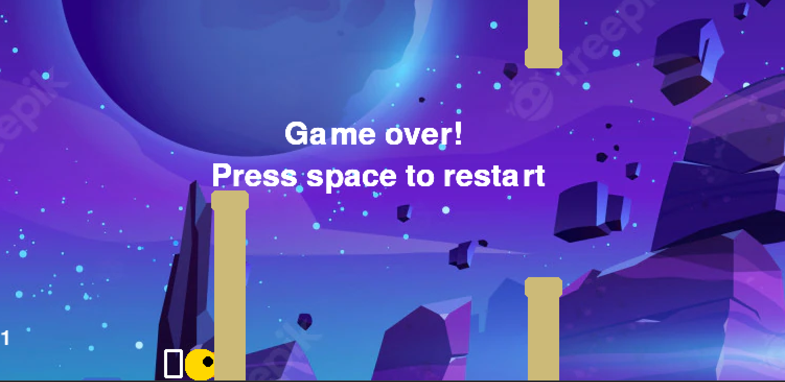

# Game
Flappy's Jetpack - PyGame(2D Game)

# Flappy's Jetpack
"Flappy's Jetpack" is an exciting and challenging game where players navigate a character through various obstacles. Developed using Python and the Pygame library, this game offers engaging gameplay with a mix of skill and fun.

## Description
In "Flappy's Jetpack", the player controls a character equipped with a jetpack, navigating through a series of obstacles. The game is set against a dynamic background and is accompanied by captivating music and sound effects. The objective is to achieve the highest score by avoiding obstacles and making strategic movements.

## Features
- Engaging in side-scrolling gameplay.
- Randomly generated obstacles for a unique experience every time.
- Score tracking to record the player's best attempts.
- Simple yet captivating graphics and design.
- Intuitive controls - use the space bar to maneuver the character.
- Sound effects and background music to enhance the gaming experience.

## Requirements
To run "Flappy's Jetpack", you will need:
- Python (preferably the latest version)
- Pygame library installed
- Sound and music files (included in the game package)

## Installation
To install and run the game, follow these steps:
# Clone or download the game repository
# Navigate to the game directory
# Ensure Python and Pygame are installed
# Run the game using Python:
python main.py

## Gameplay and Controls
- Use the space bar to control the jetpack's altitude.
- Avoid obstacles and try to get as far as possible.
- The game ends when the player collides with an obstacle.

## Contributing
Contributions to "Flappy's Jetpack" are welcome! Whether it's bug fixes, new features, or improvements to the code, your input is valuable.

## Screenshots

